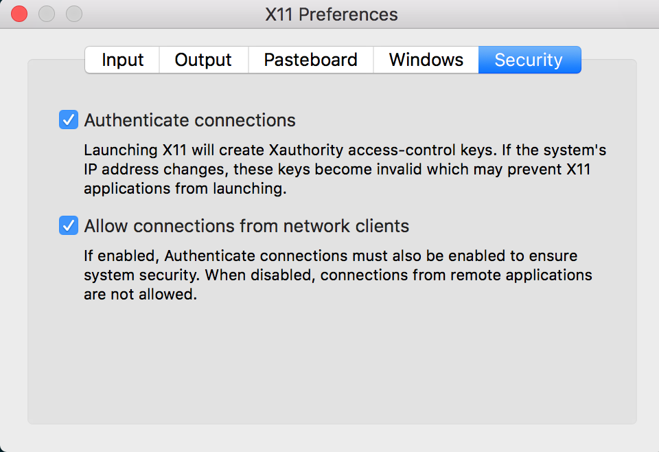
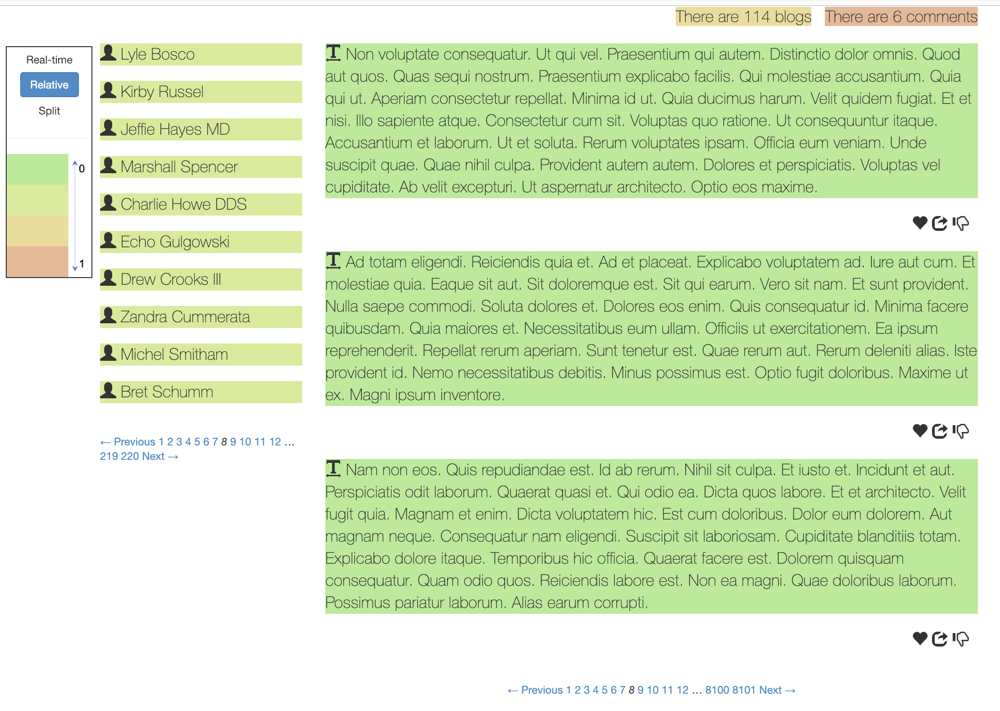

<div class="container" markdown="1">
<div class="row" markdown="1">
<div class="col-md-12" markdown="1">

We provide a docker image that contains Panorama and all the applications we use in the paper.
Below are steps to run Panorama and reproduce the experiments on docker.

### Pull and run the docker image 
* Login to you docker hub account and pull the [docker image](https://cloud.docker.com/repository/docker/panorama/chrome):
```
$ docker pull panorama/chrome:fifth
```

* If you are using Mac OSX, ensure `xhost +` can be executed successfully, and copy the following into a script file (e.g., `start.sh`), and login to the docker image by running this script:
```
#!/bin/bash
IP=$(ifconfig en0 | grep inet | awk '$1=="inet" {print $2}')
docker run -it \
-e DISPLAY=$IP:0 \
--privileged \
-p 127.0.0.1:3000:3000 \
-v "${HOME}/.Xauthority:/root/.Xauthority" \ # you can also remove this
-v /tmp/.X11-unix:/tmp/.X11-unix \
panorama/chrome:fifth
```
Make sure [XQuartz](https://www.xquartz.org) is installed and opened before running the script. Set the preference as the picture below:<br/>
<br/>
If you are using Linux, execute the following script
```
$ export DISPLAY=127.0.0.1:0
$ xhost +
$ sudo docker run -it \
--net host -e DISPLAY=127.0.0.1:0 \
--privileged -p 127.0.0.1:3000:3000 \
-v "${HOME}/.Xauthority:/root/.Xauthority" \ # this can be removed
-v /tmp/.X11-unix:/tmp/.X11-unix \
panorama/chrome:fifth
```
If `xhost +` reports the error "unable to open display", then go to the `/etc/gdm3/custom.conf`, add `DisallowTCP=false` under `[security]` and restart your machine.

### Start RubyMine and run the application
* Run script on the docker to start RubyMine:
```
$ cd /home
$ ./start-rubymine.sh
```
A RubyMine IDE will be opened.

* Start a chrome browser:
```
$ ./start-chrome.sh
```
A chrome browser will be launched.

* Start mysql server:
```
$ ./start-mysql.sh
```
Mysql server will start with OK status.

* Choose an application and run it. We use a blogging application as example. You can go to the application folder (located in `/home`):
```
$ cd /home/blog-app/
$ bundle exec rails server &
```
or simply use the script we provided to start the app, and pass app location as parameter:
```
$ cd /home
$ ./start-app.sh /home/blog-app/
```
Then you can go to the browser and visit the application by the address `https://localhost:3000`.

### Start Panorama
* Before running Panorama, you may first visit a few webpages in the chrome. This will generate a log file, which will be analyzed by Panorama.

* Then go to the panorama folder and run the script to start a thread to monitor the browser activity, and send a request to change the source code if a patch suggestion is granted:
```
$ cd /home/panorama-static-analyzer
$ ./compute_performance.sh PW-blog /home/blog-app/ BlogsController,index
```
For other applications, replace `PW-blog` with application name, `/home/blog-app/` with the path to the app source, and `BlogsController,index` with the controller action you want to exam.

* In the RubyMine IDE, open the app and turn on the Panorama:<br/>
<br/>

### Read the heatmap and check Panorama's suggested patches
* Refresh the webpage it will look like this:<br/>
<br/>
Lefthand side is a legend shows the "heat", i.e., the cost to generate each element, with cooler color (on the side of scale 0) indicating less time and warmer color indicating more time. By default it shows the static cost, and you can choose other measuring method like using real cost numbers. 

* When you move the cursor to an element and click, it will show patches that Panorama can generate to accelerate the element:<br/>
<br/>
<br/><br/>
Click the patch (e.g., pagination) and you can view the code change:
<br/><br/>
It shows which file it will change, the old code and the new patch code.
If you wish to adopt a patch, click the "AcceptOrNot" on the "Panorama" menu, and the click "ok".

* Panorama will change the application source code if you accept a patch, and then you can see the accelerated webpage:<br/>
<br/>

### Reproduce experiments in Section VII.
* RQ1: how many opportunities does Panorama identify?
```
$ cd /home/panorama-static-analyzer/controller_model_analysis/
$ ./run_RQ1.sh
```
The detected optimized opportunities will be generated and found in folder ```/home/panorama-static-analyzer/controller_model_analysis/opportunities```.
The generated patches can be found ```/home/panorama-static-analyzer/controller_model_analysis/patches```

* RQ2: how much performance benefits?
```
cd /home/panorama-static-analyzer/controller_model_analysis/
./run_RQ2.sh
```
The results are genearted from applications' running logs including end to end time and server time, which are stored under ```/home/panorama-static-analyzer/controller_model_analysis/RQ2``` in both ```eoe``` and ```server```.


* RQ3: are alternate view designs worthwhile?<br/>
  * Questionnaire can be found [here](https://uchicago.co1.qualtrics.com/jfe/preview/SV_3HNaVHXVyhsdDZr?Q_SurveyVersionID=&Q_CHL=preview).<br/>
  * The raw-data of answers from participants can be found [here](https://docs.google.com/spreadsheets/d/1EAq7ZhROnu2BCQkXYpV9XcrYSkna5FVxy2-WgOg5r2M/edit?usp=sharing), which are all de-identified. 

* RQ4: how accurate is Panorama profiler?
```
$ cd /home/panorama-static-analyzer/controller_model_analysis/
$ ./run_RQ4.sh
```
The complexity of tags will be printed out. And the end-to-end time for each design will be printed out, which comes from our previous running logs. 

</div>
</div>
</div>
